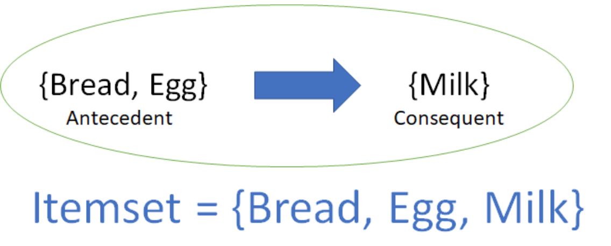

### 1. Affinity analysis (or Market basket analysis)

- Study of attributes or characteristics that go together
  
- Association rules take the form "If antecedent, then consequent"

){:height="40%" width="40%"}

- Itemset is the list of all the items in the antecedent and the consequent

- Implication here is co-occurrence and not causality

### 2. Metrics to measure association rule

**Case study**

- Total transactions in a supermarket on Sat is: 1,0000 transactions

- Consider: 
  
  -  1-itemsetA = {bread}
  
  -  1-itemsetB = {shampoo}
  
  - 2-itemsetC = {bread, milk}

  - 2-itemsetD = {shampoo, milk}

***SUPPORT*** metric = $\frac{Transaction containing X}{Total transaction}$

Example 1:

- 1000 customers shopping today
  
  - 200 bought diapers

  - Of the 200 who bought diapers, 50 bought beer

=> Association rule: "If buy diapers, then buy beer":

  - Support = 50/1000 = 5%: There is 5% of customers purchased both beer and diapers

  - Confidence = 50/200 = 25%: Among those who purchased diapers, there is 25% of those who purchased beer

Example 2

Left handside: {squash} => Right handside: {beans}

Support = 0.428: There are around 42.8% of customers purchased both squash and beans

Confidence = 0.857: Among those who purchased squash, there is around 85.7% of those who purchased beans

Lift = 1.2: If we know customer purchases squash, there is 1.2 times more likely to buy beans than all of other customers.

### 2. Data representation for Market basket analysis

There are 2 principal methods of representing this type of market basket data

- Use transactional data

- Use tabular data format 

