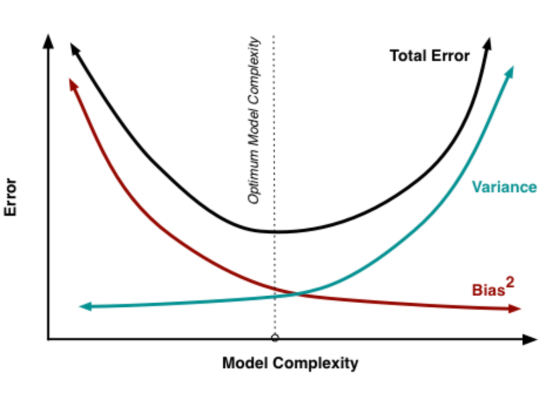
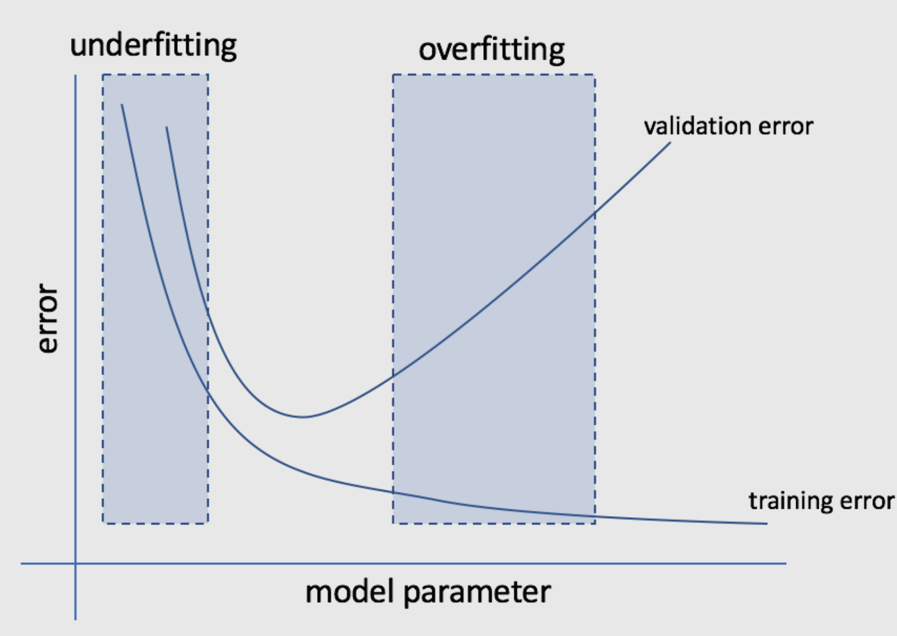
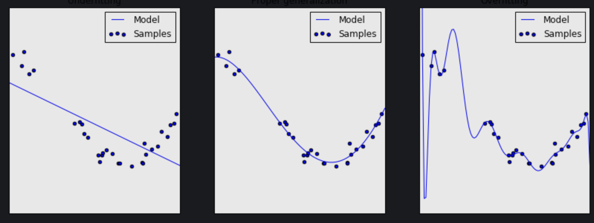
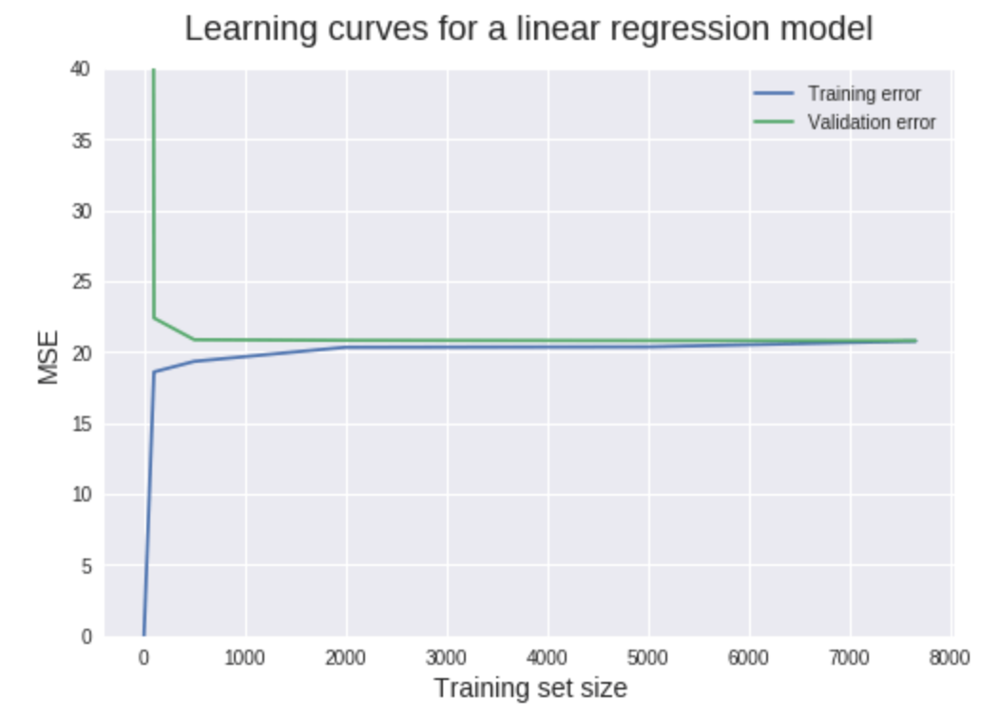

## 1. Bias (Underfitting)

Models with high bias is known as underfitting: try to teach model to perform a task without presenting all of the necessary information. It is likely that you are not using enough features to train the model

## 2. Variance (Overfitting)

On the other extreme, model learns too much from training data, even capturing the noise in the data in addition to the signal. Model with high variance pays too much attention to the training data without considering for generalizing to new data. 

## 3. Trade-off of bias and variance

If we want low bias -> need to make model more complex to fits almost perfectly all the data points in the training set -> likely overfitting (high variance)

If we want low variance to avoid overly complex model -> likely that model is too simple and performs poorly on training data that extremely likely to repeat the poor performance on test data

=>We need to accept a trade-off. We can not have both low bias and low variance, so we want to aim for something in the middle.

{:height="60%" width="60%"}

## 4. Common tools to diagnose high bias or high variance

### a. **Validation curve**

The parameters of model have some degree of control over the model's complexity (eg. degree of polynomial features)

-> Validation curve is a plot of the model's error as a function of some model hyperparameher which controls the model's tendency to overfit or underfit the data.

On this curve, we plot both training error and validation error of the model. 

{:height="60%" width="60%"}

>*Interpretation:* 

When parameter is small -> the error of model is high for both training and validation error. For example, in the 1st graph, regression model with degree = 1 -> underfit data. 

When parameter increased -> training error and validation error decreased although validation error must be larger than training error. The middle graph illustrated this. 

When parameter is really big (eg. degree = 10), the training error is low but the model does not generalize well (overfit) -> it performs poorly on new test data -> validation error increased. The last graph illustrated this. 

{:height="60%" width="60%"}

### b. **Learning curve**
We plot error of a model as function of number of training examples. We will plot the error for both the training data and validation data

{:height="60%" width="60%"}

>*Interpretation:* When size of training set is 1, MSE for training set is 0. This makes sense because model has no problem to train and fit perfectly a single data point. So, prediction on training set with size = 1 is perfect. However, using this trained model on 1 instance to predict validation set (which has 1999 instances), MSE is extremely high. This makes sense again because no way a model trained on a single data point can generalize accurately to 1999 new instances it has not seen in training. 

