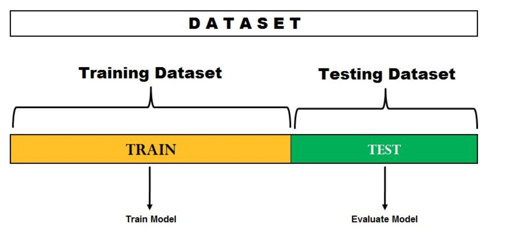
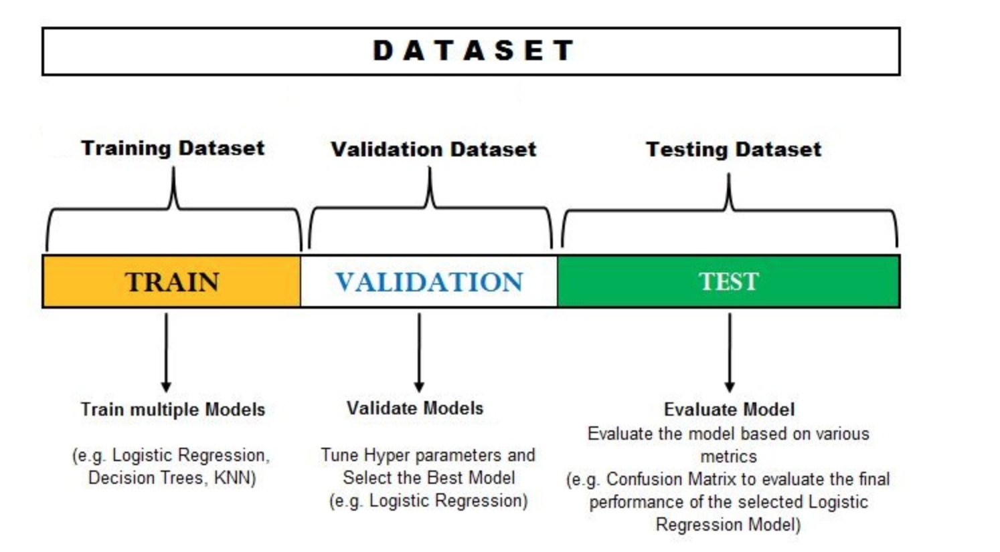
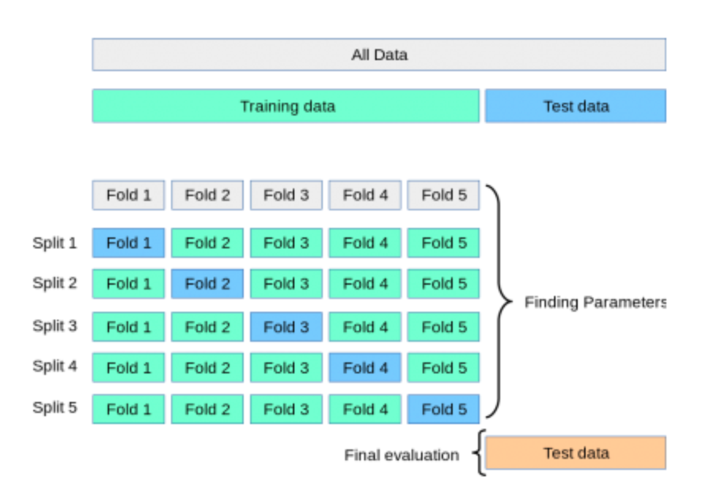
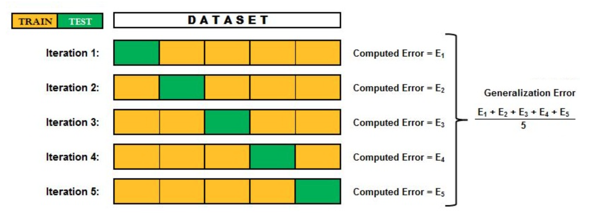
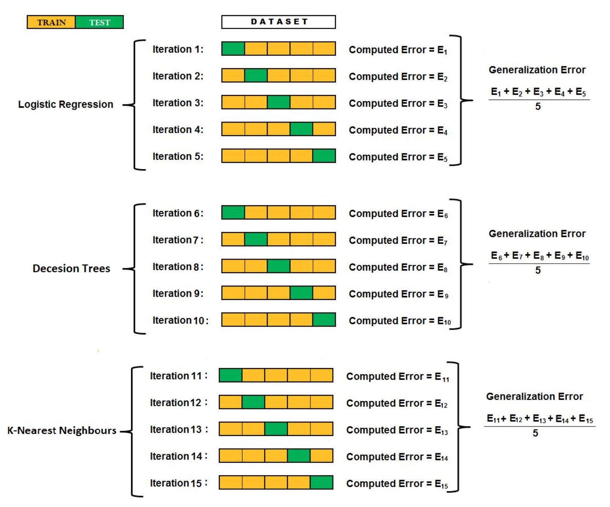

### 1. Why need model evaluation ?

- Find the best model that represents our data and how well the chosen model will work in the future

- Evaluating model performance using training data is not acceptable because it will generatate overfitted and overoptimistic models. 

### 2. Holdout method

a. Holdout method with 2 datasets: Training and Test set (hold-out set)

{:height="60%" width="60%"}

- After training model, use it to predict on Testing dataset. Next, compute error using various metrics depends on Regression or Classification problems. 

- Typically the training dataset is bigger than testing dataset. 

- This method is only used when we only have one model to evaluate and no hyper-parameters to tune.

- Limitation of this method: 
  
+ Training or testing dataset are not able to represent the actual complete data, then the results from the test sets can be skewed. 

+ Error after applying model on testing dataset can highly depend on the observations of training and testing dataset

+ Not effective for comparing multiple models and tuning their hyperparameters.

b. Holdout method with 3 datasets: Training, Validation and Test set

{:height="60%" width="60%"}

-  After training model using training dataset, apply the built model on validation set to assess the model performance. We can tuning model's hyper-parameters and come back validation set to assess the model again. Finally, selecting the best-performing model with a specific combination of hyper-parameters. 

- Limitation of this method: When we tune the hyper-parameters based on the validation set, we end up slightly overfitting the model because of depending on validation set. Thus, the accuracy we receive from validation set is not considered final. As a result, test dataset is used to evaluate the final selected model, and the error found on test dataset is considered as the generalization error 

### 3. Cross validation

In practice (e.g in many Kaggle competitions), the validation set is released initially along with training set, and the actual test set is only release when the competition closes. Error on test set is the result of the model and decides the winner. *The test set contains carefully sampled data that spans the various classes that the model would face when used in the real world*

As we mentioned about limitation of hold-out method with validation, the performance of model highly rely on validation and training set. Additionally, we only train and evaluate once, so the performance depends on only one evaluation. As a result, it may perform very differently when trained and evaluated on different subsets of the same data.

a. **Cross validation - the general idea**

{:height="60%" width="60%"}

- Firstly, separating test set from entire original data set to use for the final evaluation of model. 

- Remaining data (everything except test set) is split into K number of folds.

- At each iteration, use one of K folds as validation set, and using all remaining folds as training set. 

b. **Cross validation with 1 model **

{:height="60%" width="60%"}

- If we choose K = 5, then we will have 5 iterations and at each iteration, whole dataset will be divided into 5 equal parts. 
  
- Model will be trained on 4 parts and evaluated on the fifth part. 

- Finally, results from each iteration are combined and averaged to come up with the final error. 

c. **Cross validation with many models **

If we train model using many different algorithms such as Logistic Regression, Decision Trees and KNN, above step will run separately for each of these models. And we will have 3 generalization error values to choose from.

{:height="60%" width="60%"}

**Conclusion**: Cross validation reduces the bias and variance, meaning that the model does not overfit or underfit. It also help to find the best model. It also can use to optimize the hyper-parameters.

## 4. Example of cross validation include step of tuning hyper-parameters

Case study

- Predict binary classification problem

- 3 models: KNN, Decision Trees and Support vector machines (SVC)

- Problem: Find the best model ? 

Assume that in each model, there is 2 hyper-parameters need to tune. E.g KNN has hyper-parameter N with possible values = 3,4; SVC has hyper-parameter C with possible values = 1,2; Decision Tress has hyper-parameter Depth with possible values = 100,200. 

- Start off with Decision Tree. Possible values of Depth hyper-parameter is 100, 200. 

    + We begin by setting value of Depth hyper-parameter of Decision Tree at 100.
    
    + We set 5-fold cross validation (split data into 5 folds and there is 5 iterations)

    + We perform 5 iterations. At each iteration, we train Decision Tree model with hyper-parameter Depth = 100 on (k-1 = 5 - 1 = 4) parts. Then, evaluate the model on the remaining fold (1 part). All the results produced from these 5 iterations are averaged and we get the result for the value of model Decision Tree with hyper-parameter Depth being 100. 

    + We repeat the whole process 5-fold cross validation with value of hyper-parameter Depth = 200. 

    + Then, compare result between hyper-parameter Depth = 100 and hyper-parameter Depth = 200 to choose the best value for Decision Tree model. 

- Since we have 2 more models, we perform all above steps for each model and at each value of their hyper-parameters.

- As a result, we will have generalization error values of each model at each value of their hyper-parameters (In our case study, we will have 6 generalization error values). Finally, select the one that provides us with the minimum error. 

**Conclusion**: We not only select the best hyperparameter, but also find the best model.

### 5. Other types of cross validation

- Nested K-Fold Cross validation

- Repeated K-Fold Cross validation

- Stratified K-Fold Cross validation

- Leave-one-out cross validation and leave-p-out cross validation

--------------
References

https://towardsdatascience.com/train-validation-and-test-sets-72cb40cba9e7

https://www.datavedas.com/k-fold-cross-validation/
