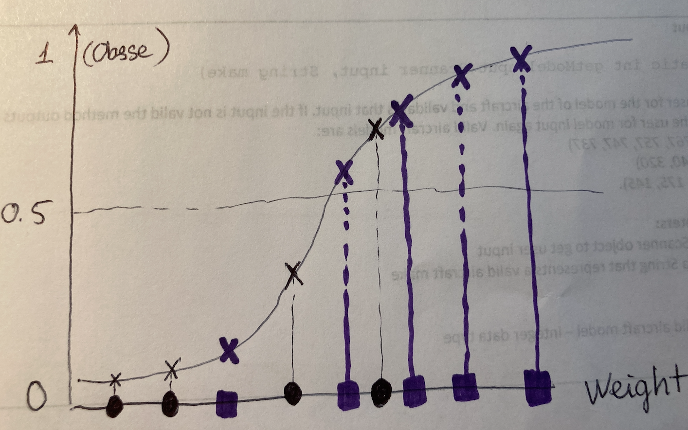
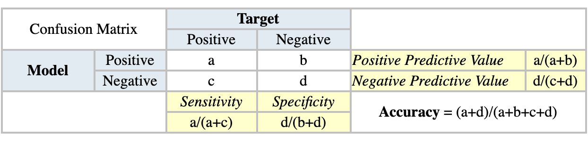
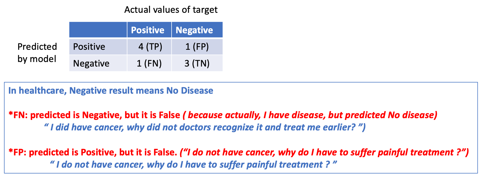
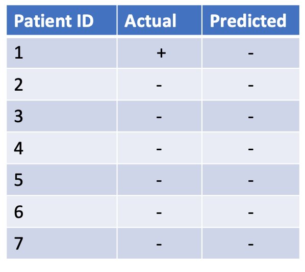
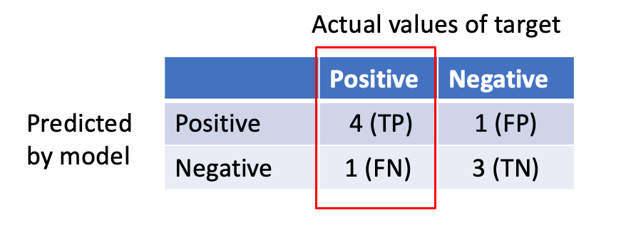
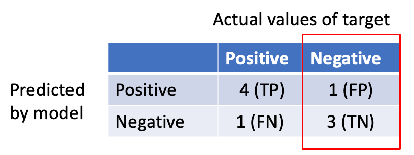
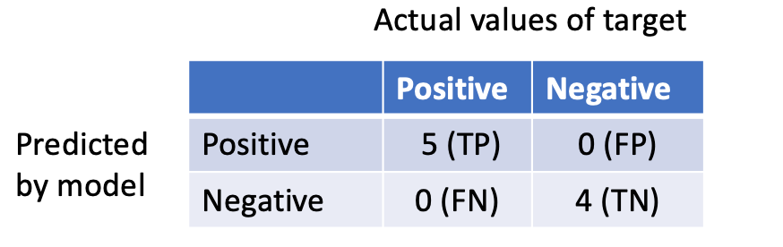
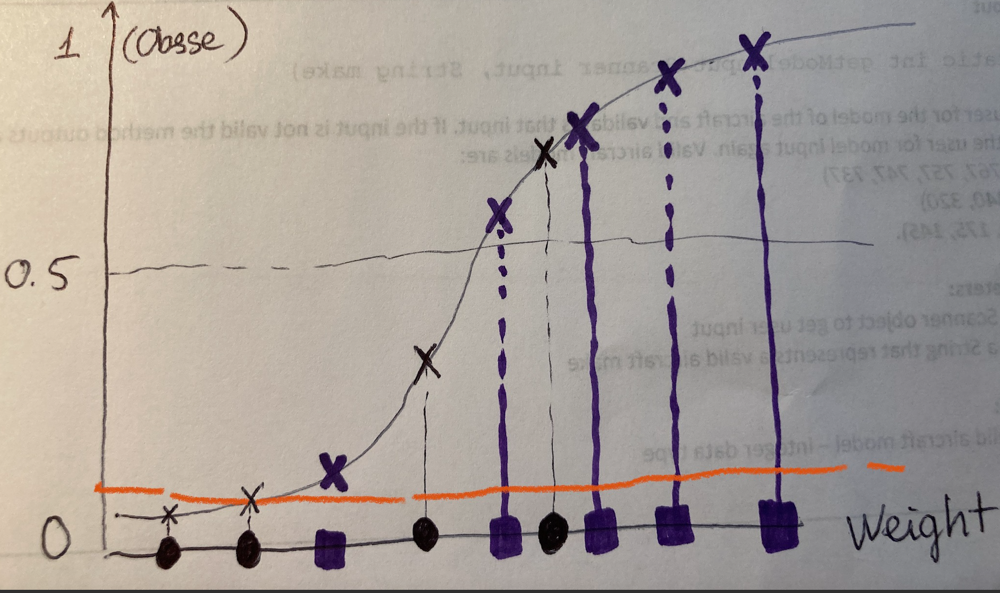
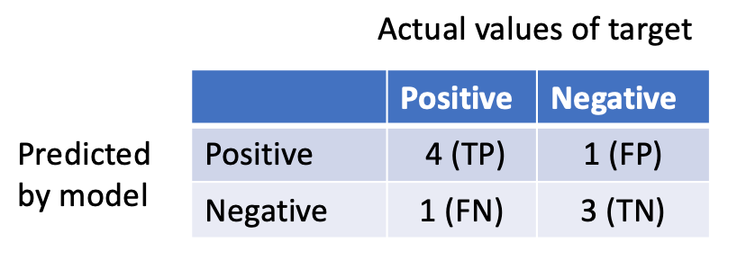
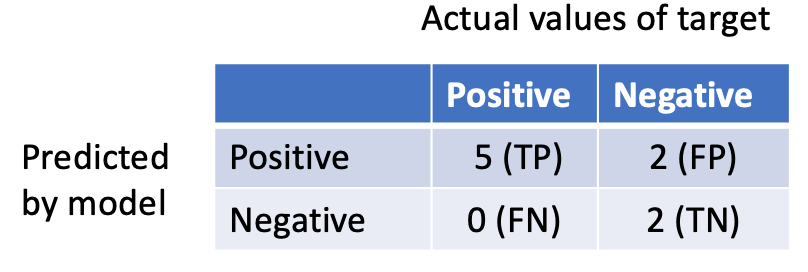

### Logistic/Sigmoid function

Because classification problem only have target categorical (or binary) variables, e.g predict obese (1) or not obese (0), we can not draw a function like linear regression. That is the reason we have to choose another function that its shape can represent data better. In classification problem, most are Logistic/sigmoid function.

 {:height="40%" width="40%"}

 **Note**: Purple is actual positive; and black is actual negative 

Original data only shows weight and we have to predict if the person is not obese (0) or obese (1). Some people has very low weight, then we are quite confident that they are not obese. Similarly, some people has very high weight, and we are quite sure that they are obese. How is about the other people with weight not too low but also not too high ? Even our prediction still might be wrong for those who we are quite confident. There is no way to be confident 100%. Consequently, we only can say ***the probability*** of obese. Each person will have a probability of obese based on their weight. 

Next, we need one way to convert these probabilities into classification: Obese or Not obese. It is the goal of problem. So, we need a threshold (cutoff) to classify. Assuming that we choose a threshold = 0.5. After that, we will check prediction with actual value using **Confusion Matrix**

### Confusion Matrix

{:height="40%" width="40%"}

In our above graph, we have

- 9 patients in total

- At cutoff = 0.5:
  
  + 4 patients are assigned "Obese" correctly: TP  => a = 4 

  + 1 patient are assigned "Obese" wrongly: FP => c = 1

  + 3 patients are assigned "Not Obese" correctly: TN => d = 3

  + 1 patient are assigned "Not Obese" wrongly: FN => b = 1

{:height="60%" width="60%"}

Terminology about confusion matrix in healthcare:
| **TP** | **FP** |
|-----|-----|
Have disease & assign correctly | Predicted Positive (Disease) BUT it is false prediction because actually, they is Negative (No Disease) => No Disease BUT assign to Disease.

| **TN** | **FN** |
|-----|-----|
No disease & assign correctly | Predicted Negative (No Disease) BUT it is false prediction because actually, they is Positive (Disease) => Disease BUT assign to No Disease

### Accuracy score 

Here is an example why accuracy score does not work well

{:height="40%" width="40%"}

If we guess randomly that all patients is Negative (Not disease), our prediction is still correct to (6/7) = 85%. That is because of imbalanced data

### Sensitivity / Recall / TPR

$$ \frac{TP}{TP + FN} $$

{:height="40%" width="40%"}

**Interpretation**

Recall = $\frac{4}{4+1}$

Recall describes the number of positive cases the model detected correctly out of total actual positive cases. Actually, we have 5 obese patients, but the model only can detected 4. ***Our one actual positive case was wrongly assigned to negative (FN)***. So, we have to add TP with FN to have total actual positive cases. 

=> To find FNR

 $$
 1 - \frac{TP}{TP + FN}
 $$

### Specificity

$$ \frac{TN}{TN + FP} $$

{:height="40%" width="40%"}

**Interpretation**

Specificity = $\frac{3}{3+1}$

Specificity describes the number of negative cases the model detected correctly out of total actual negative cases. Actually, we have 4 NOT obese patients, but the model only can detected 3. ***Our one actual negative case was wrongly assigned to positive (FP)***. So, we have to add TN with FP to have total actual negative cases. 

=> To find FPR (*False alarm rate*)

$1 - \frac{TN}{TN + FP}$ = $\frac{FP}{TN + FP}$

### ROC

At each different threshold, {TP, TN, FP, FN} vary. Ideally, we would like to have a threshold that can correctly classify all. 

{:height="40%" width="40%"}

***To avoid missing positive cases, we predict most of them are positive. Because we try to assign many positive cases as possible (TP increases), some of them will be assigned wrongly (FP increases). This also remains true to negative cases. If we simply predict most of them are negative, then yes, the number of True Negative will increase, but at the same time, some of them are assigned wrongly. (FN increases)***

To clarify this trade-off, we will check TP, TN, FP, FN at different threshold values. 

{:height="40%" width="40%"}

- If threshold is 0.5, we did not predict correctly all positive cases and negative cases. So, FP and FN still exist.

{:height="40%" width="40%"}

- If we let threshold lower, we can predict correctly all positive cases (TP increases), but at the same time 2 actual negative cases are assigned wrongly to positive. Consequently, FP goes from 1 case to 2 cases.

{:height="40%" width="40%"}

- If we let threshold higher, we can predict correctly all negative cases (TN increases), but at the same time actual positive case are assigned wrongly to negative. Consequently, FN will increase.

