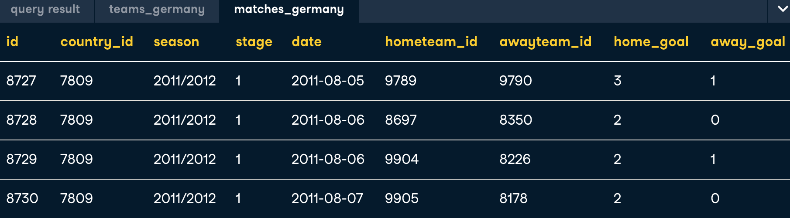
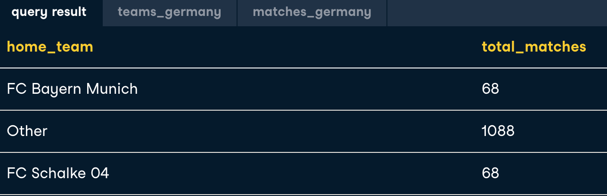

### 1. CASE statements

{:height="60%" width="60%"}

```-sql
SELECT 
    CASE WHEN hometeam_id = 1089 THEN 'FC Schalke 04'
         WHEN hometeam_id = 9823 THEN 'FC Bayern Munich'
    ELSE 'Other' 
    END AS home_team,
    COUNT(id) AS total_matches
FROM matches_germany
GROUP BY home_teams;
```
{:height="60%" width="60%"}

```-sql
SELECT 
	-- Select the date of the match
	date,
	-- Identify home wins, losses, or ties
	CASE WHEN home_goal > away_goal THEN 'Home win!'
        WHEN home_goal < away_goal THEN 'Home loss :(' 
        ELSE 'Tie' END AS outcome
FROM matches_spain;
```