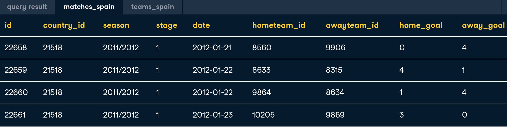
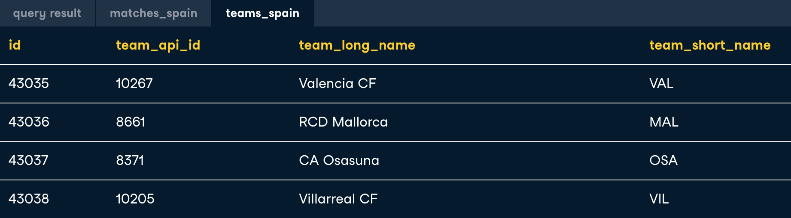
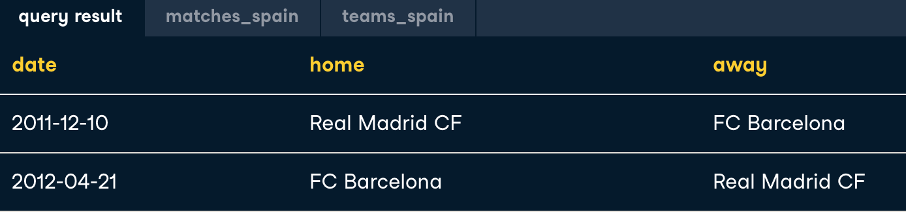
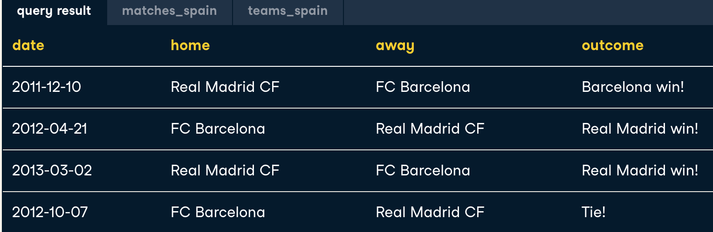
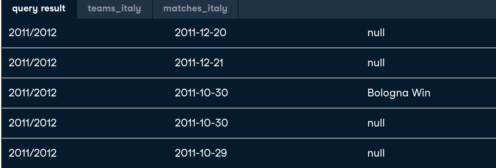
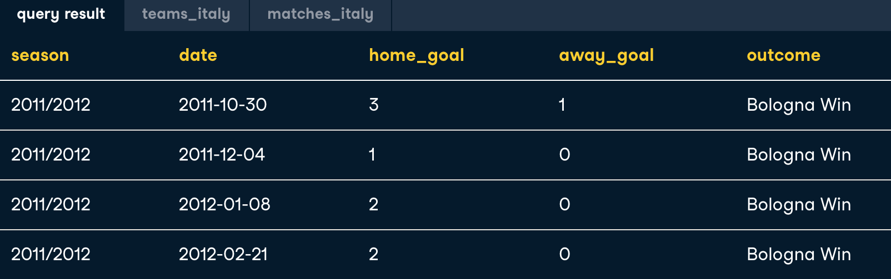

### 1. CASE statements
{:height="60%" width="60%"}

{:height="60%" width="60%"}

{:height="60%" width="60%"}

**a. CASE - basic**

```-sql
SELECT 
    CASE WHEN hometeam_id = 1089 THEN 'FC Schalke 04'
         WHEN hometeam_id = 9823 THEN 'FC Bayern Munich'
    ELSE 'Other' 
    END AS home_team,
    COUNT(id) AS total_matches
FROM matches_germany
GROUP BY home_teams;
```
{:height="60%" width="60%"}

**b. CASE - compare column values**

```-sql
SELECT 
	-- Select the date of the match
	date,
	-- Identify home wins, losses, or ties
	CASE WHEN home_goal > away_goal THEN 'Home win!'
        WHEN home_goal < away_goal THEN 'Home loss :(' 
        ELSE 'Tie' END AS outcome
FROM matches_spain;
```
 
Table **teams_spain**: 
+ Information of away team
+ team_api_id: match with **awayteam_id** of table **matches_spain**

Table **teams_spain**: 
+ Information of match between **hometeam_id** and **awayteam_id**

```-sql
SELECT m.date
       ,t.team_long_name AS opponent
       ,CASE WHEN m.home_goal > away_goal THEN 'Barcelona win!'
            WHEN m.home_goal > away_goal THEN 'Barcelona loss'
        ELSE 'Tie' END AS outcome
FROM matches_spain AS m
LEFT JOIN teams_spain AS t
ON m.awayteam_id = t.team_api_id
-- Filter for Barcelona as the home team
WHERE m.hometeam_id = 8634;
```

*Problem*: List matches between FC Barcelona(id = 8634) and Real Madrid CF (id = 8633)

```-sql
SELECT date
       ,CASE WHEN hometeam_id = 8634 THEN 'FC Barcelona'
             WHEN hometeam_id = 8633 THEN 'Real Madrid CF'
        ELSE 'Tie' END AS home
        ,CASE WHEN awayteam_id = 8634 THEN 'FC Barcelona'
             WHEN awayteam_id = 8633 THEN 'Real Madrid CF'
        ELSE 'Tie' END AS away
FROM matches_spain
--Condition: hard because just want to filter Barcelona with Real (and vice versa), not Barcelona with other teams
WHERE (hometeam_id = 8634 OR awayteam_id = 8634)
AND (awayteam_id = 8633 OR hometeam_id = 8633);
```
{:height="60%" width="60%"}

*Problem*: improve a bit from above problem 
```-sql
SELECT date
       ,CASE WHEN hometeam_id = 8634 THEN 'FC Barcelona'
             WHEN hometeam_id = 8633 THEN 'Real Madrid CF'
        ELSE 'Tie' END AS home
        ,CASE WHEN awayteam_id = 8634 THEN 'FC Barcelona'
             WHEN awayteam_id = 8633 THEN 'Real Madrid CF'
        ELSE 'Tie' END AS away
        ,CASE WHEN home_goal > away_goal AND hometeam_id = 8634 THEN 'Barcelona wins'
            WHEN home_goal > away_goal AND hometeam_id = 8633 THEN 'Real Madrid win!'
            WHEN home_goal < away_goal AND awayteam_id = 8634 THEN 'Barcelona wins'
            WHEN home_goal < away_goal AND awayteam_id = 8633 THEN 'Real Madrid win!'
        ELSE 'Tie' END AS outcome
FROM matches_spain
WHERE (hometeam_id = 8634 OR awayteam_id = 8634)
AND (awayteam_id = 8633 OR hometeam_id = 8633);
```
{:height="60%" width="60%"}

**c. Filter CASE**

Example

Step 1: Filter team = 'Bologna'

```sql
SELECT
	team_long_name,
	team_api_id
FROM teams_italy
WHERE team_long_name = 'Bologna';
```

Step 2: Identify when Bologna won a match

```sql
SELECT
	season,
	date,
    CASE WHEN hometeam_id = 9857 AND home_goal > away_goal THEN 'Bologna Win'
        WHEN awayteam_id = 9857 AND away_goal > home_goal THEN 'Bologna Win'
    END AS outcome
FROM matches_italy;
```
{:height="60%" width="60%"}


Step 3: Filter outcome "Bologna wins"

```sql
SELECT
	season,
	date,
    home_goal,
    away_goal,
    CASE WHEN hometeam_id = 9857 AND home_goal > away_goal THEN 'Bologna Win'
        WHEN awayteam_id = 9857 AND away_goal > home_goal THEN 'Bologna Win'
    END AS outcome
FROM matches_italy
WHERE
    (CASE WHEN hometeam_id = 9857 AND home_goal > away_goal THEN 'Bologna Win'
        WHEN awayteam_id = 9857 AND away_goal > home_goal THEN 'Bologna Win'
    END) IS NOT NULL;
```
{:height="60%" width="60%"}

