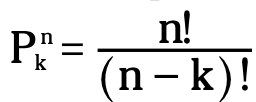

Counting rules provide a mathematical way to count the number of ways that a certain outcome can occur.

### 1. Counting on Permutations

Permutation is find the number of ways to rearrange the outcomes without replacement and the order is important. 

Formula: count the number of permutations of k items chosen from n items without replacement (n: total number of items in the population and k: the number of items being selected)

{:height="20%" width="20%"}

+ n: total number of items in the population

+ k: the number of items being selected

+ Because you select k items only, remaining items should not be concern. So, you will leave out (n - k) items unselected.

***Example 1***: Take picture of 3 boys: A, B, C. How many ways to arrange boys ?

A   B   C

A   C   B

B   A   C

B   C   A

C   A   B

C   B   A

3 choices for A; 2 choices left B (after A had its own choice); and 1 choice left for C (after A, B had their own choices). So, total number of permutations = 3 * 2 * 1 = 6

If applying the formula, you have number of permutations of 3 boys chosen from 3 boys.

P $\binom{3}{3}$ = $\frac{3!}{(3 - 3)!} = 3!$

