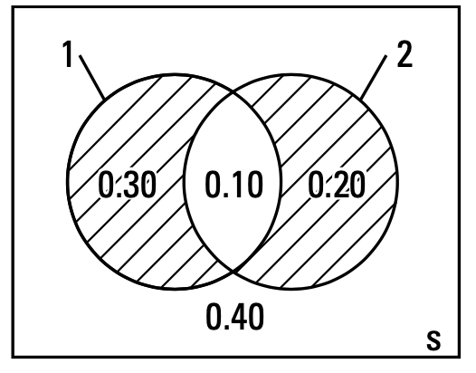
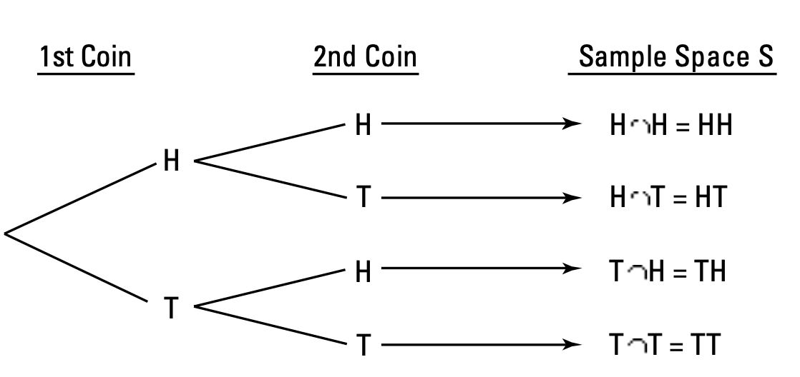
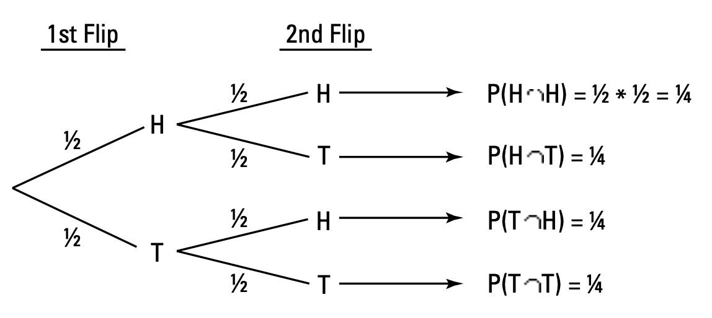
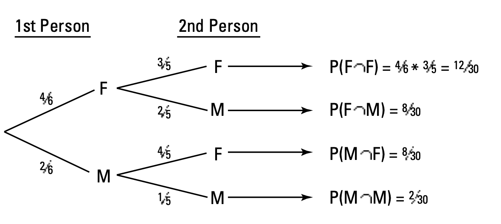

### 1. Picturing Probability

**a. Venn diagrams**

Use Venne diagrams when you are given probabilities of events by themselves (marginal) and join probabilities for A and B. In this situation, you can find probabilities for all other parts of the Venn diagram. E.g: P(neither A nor B); or P(exactly A)

*Limitation*: Venne diagrams do not work well if a problem gives you partial information like conditional probability; or when problem creates a sequence of events that happen in the a certain order. 

***Example***: Street has 2 traffic lights. P(red on 1st light) = 0.4; P(red on 1st light) = 0.3. P(red of 2 lights at the same time) = 0.1

*P(neither light is red) ?* = everything in S that is not included in A or B or both = $(A \cup B)^c$ = 1 - (0.3 + 0.1 + 0.2) = 0.4

{:height="30%" width="30%"}

*P(exactly one of light is red) ?* = either the first light is red and the second is not, or the second light is red and the first is not = Either part 1 or part 2 in venn diagram. Because two part are mutually exclusive, using the addition rule to find P(xactly one of light is red) = 0.3 + 0.2 = 0.5

{:height="30%" width="30%"}

**b. Tree diagrams**

Use when probability problems involve multiple stages or a sequence of events. Each possible outcome within a given stage is represented by another branch on the tree. 

*Limitation*: Tree diagram do not work well if problems give you intersection probabilities rather than conditional probabilities.

**Tree diagram for independent events**

***Example***: Flip a coin twice. This a 2-stage process: first 1st coin get either heads or tails; then 2nd coin get either heads or tails again. Sample space shows the combination of all possible outcomes of both stages. 

{:height="40%" width="40%"}

Because 2 coins do not influence each other, outcomes are independent. So, to get the join the probability each, multiply the marginal probabilities (the probability of an individual outcome on each coin)

{:height="40%" width="40%"}

**Tree diagram for dependent events**

***Example***: In a group there are 4 females and 2 males. We need to select 2 people to be on the committee. Of course, we can not choose the same person twice. 

- At 1st stage: P(female) = 4 out of 6 and P(male) = 2 out of 6

- At 2nd stage *(called conditional probabilities because events depend on the 1st stage)*: because can not choose the same person twice, this is where the probabilities change. Assuming that you choose a female in 1st stage, we have 5 people left to choose: 3 females and 2 males: P(F $\vert$ F) = 3/5. Similarly, if you choose male at 1st stage, 5 people left to choose: 4 females and 1 male.  

{:height="40%" width="40%"}

### 6. Bayes Theorem (Reversing Conditional probability)

In conditional probability, we have to compute P(A $\vert$ B). Conversely, we need to know P(B $\vert$ A) if we know conditional probability P(A $\vert$ B). Bayes theorem now comes into the picture. 

Bayes theorem describes the probability of an event based on the prior knowledge of the conditions that might be related to the event. 

{:height="40%" width="40%"}

$
         P(B|A) = P(A|B) * \frac{P(A)}{P(B)}
$

***Example 1***: You are planning a picnic today, but the morning is cloudy

- Given that 50% of all rainy days has cloudy, meaning Rainy -> Cloudy = 50% => P(Cloudy|Rainy) = 0.5

- Cloudy mornings are about 40% of days => P(Cloudy) = 0.4

- This is a dry month, only 3 out of 30 days tend to be rainy or 10% => P(Rainy) = 0.1

$
         P(Rainy|Cloudy) = P(Cloudy|Rainy) * \frac{P(Cloudy)}{P(Rainy)} = 0.125
$

Or 12.5% chance of rain. Not too bad, let's have a picnic

***Example 2 (Advanced)***

- 1.48 out of 1,000 people have breast cancer in the US at the time of survey.
=> P(cancer) = 1.48/1,000 = 0.00148

- Sensitivity of the test (TPR): 93%

- Specificity of the test (TNR): 99%

Please read more [Sensitivity & Specificity](https://lytranp.github.io/notes/ROC)

P(cancer|positive test)?

Because 0.148% chance that patient have cancer, (100% - 0.148%) chance that patient does not have cancer. 

{:height="40%" width="40%"}

P(cancer|positive test) = P(cancer AND positive test) / P(positive test)

Because a person can have cancer and test positive or he may not have cancer but still test positive => P(positive test) = P(cancer AND positive test) + P(no cancer AND positive test)

P(cancer AND positive test) = P(cancer) * P(positive test) = 0.00148 * 0.93

P(no cancer AND positive test) = P(no cancer) * P(positive test) = 0.99852 * 0.01

So, P(cancer|positive test) = P(cancer AND positive test) / P(cancer AND positive test) + P(no cancer AND positive test)