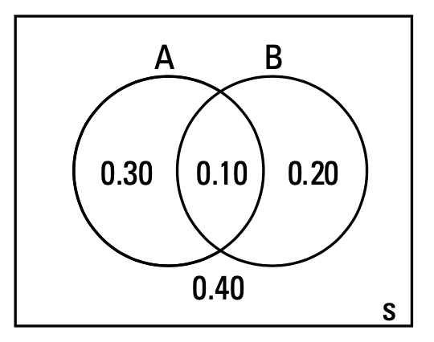

### 1. Picturing Probability

a. Venn diagrams

Use Venne diagrams when you are given probabilities of events by themselves (marginal) and join probabilities for A and B. In this situation, you can find probabilities for all other parts of the Venn diagram. E.g: P(neither A nor B); or P(exactly A)

Venne diagrams do not work well if a problem gives you partial information like conditional probability; or when problem creates a sequence of events that happen in the a certain order. 

***Example***: Street has 2 traffic lights. P(red on 1st light) = 0.4; P(red on 1st light) = 0.3. P(red of 2 lights at the same time) = 0.1

P(neither light is red) ? = everything in S that is not included in A or B or both = $(A $\cup$ B)^c$.

{:height="30%" width="30%"}

